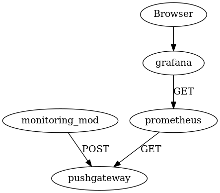

# Standlone monitoring server setup

</img>

## Prometheus

https://prometheus.io/download/

* prometheus


prometheus.yml
```yml
global:
  scrape_interval:     5s
  evaluation_interval: 15s

scrape_configs:
  - job_name: 'minetest'
    static_configs:
    - targets: ['localhost:9091']
```


```bash
./prometheus
```


## Pushgateway

* pushgateway


```bash
./pushgateway
```

## Grafana

https://grafana.com/grafana/download

```bash
./bin/grafana-server
```

http://127.0.0.1:3000/login

* admin:admin

new datasource: http://127.0.0.1:9090

### Import dashboards

dashboard-overview.json

* "+" Sign on the left
* Import
* Paste json
